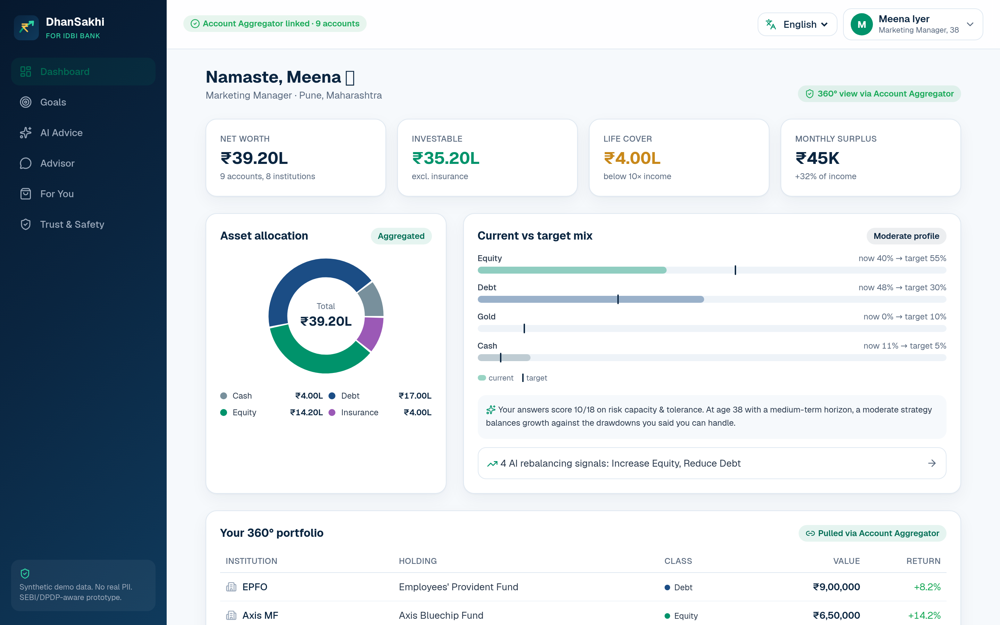
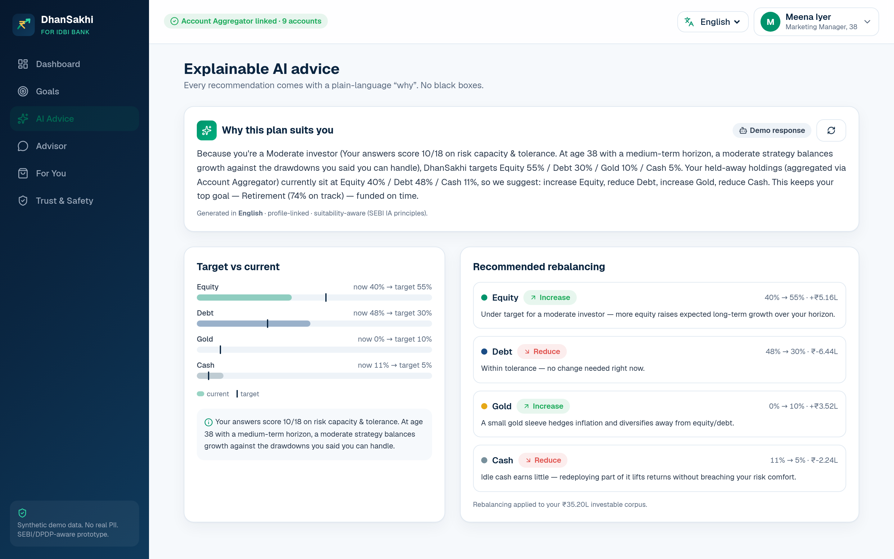
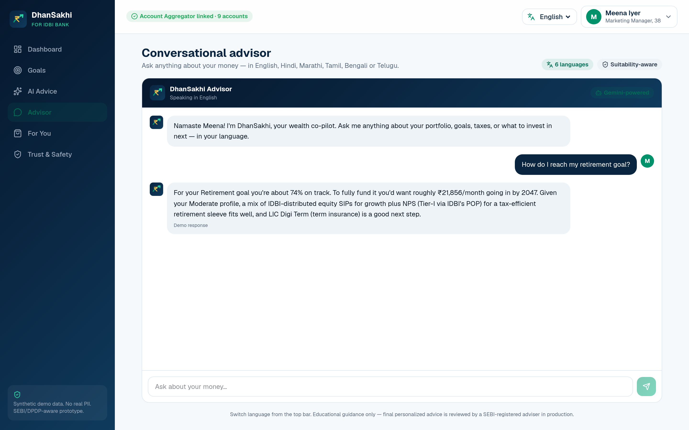
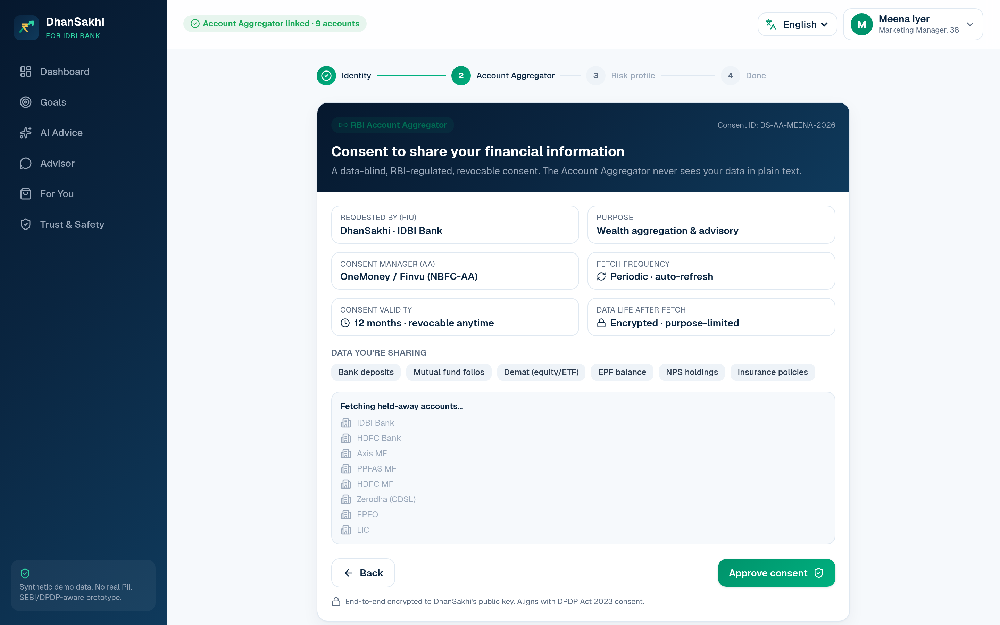
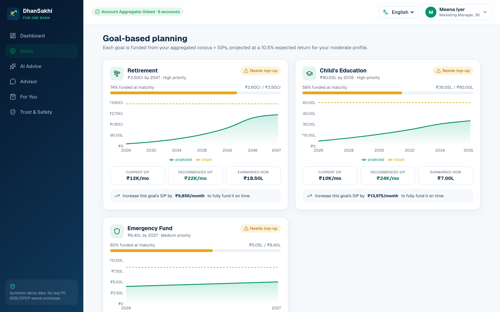
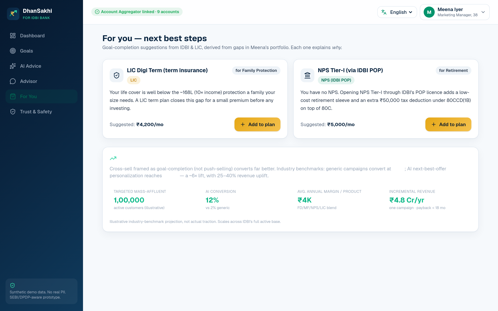

<div align="center">


# DhanSakhi — AI Robo-Advisor for IDBI Bank

**Trust of a bank, intelligence of a super-app.**

An **Account-Aggregator-native, explainable, vernacular** AI wealth co-pilot.
Built for **IDBI Innovate 2026 · Digital Wealth Management** track.

**[▶ Live demo](https://idbi-innovate-26.vercel.app)** · [Demo video](https://drive.google.com/file/d/1-ZobKRuBWrzYHAqD9f_Xko-KFBlIHDsC/view?usp=sharing) · [Pitch deck (PDF)](deck/DhanSakhi_IDBI_Innovate_Submission.pdf) · [Blueprint](docs/BLUEPRINT.md)

</div>

---

## The problem

India's mass-affluent customer — *Meena, 38, a Pune IDBI customer* — has savings scattered across
5+ institutions (FDs, MF folios, demat, EPF, an old LIC policy) with **no single view and no
affordable advice**. Quality advisory is HNI-only; everyone else gets DIY apps or mis-selling.

## What DhanSakhi does

DhanSakhi gives every IDBI customer a personal robo-advisor:

1. **One-tap RBI Account Aggregator consent** pulls *all* their holdings — bank, mutual funds, demat, EPF, NPS, insurance — no CAS/PDF uploads.
2. **AI risk-profiles** them and builds **goal-based plans** (retirement, education, home, emergency).
3. **Explainable AI advice** — every recommendation and rebalance ships a plain-language *"why this, why now"*.
4. A **vernacular conversational advisor** (Google Gemini) answers anything, in **6 languages**.
5. An **IDBI + LIC cross-sell engine** maps goals to real products (FD, MF, NPS via IDBI POP, LIC insurance/annuity) — as goal-completion, not push-selling.

> **The wedge no one owns:** standalone apps are smart-but-not-trusted; bank apps are trusted-but-shallow. DhanSakhi is both — AA-native aggregation + explainable AI + vernacular advice + bank-grade IDBI/LIC products.

## Screenshots

| 360° Dashboard | Explainable AI advice | Vernacular advisor |
|---|---|---|
|  |  |  |

| AA consent artefact | Goal planning | IDBI/LIC cross-sell |
|---|---|---|
|  |  |  |

## The golden path

`KYC-lite → AA consent & 360° aggregation → AI risk profile → goal plan → explainable advice & rebalance → vernacular advisor → IDBI/LIC cross-sell`

## Architecture

```
Customer (web/mobile, inside IDBI net-banking)
        │ HTTPS
Next.js 16 App Router (Vercel) — React 19 · Tailwind v4 · Recharts
        │ server route handlers
 ┌───────────────┬────────────────────┬────────────────────┬─────────────────┐
 │ AA Connector  │ Recommendation     │ Gemini API          │ IDBI + LIC      │
 │ (simulated    │ Engine (TS:        │ (advisor +          │ product catalog │
 │ FIP→FIU)      │ risk, alloc,       │ explainability,     │ (FD/MF/NPS/LIC) │
 │ consent       │ goals, rebalance,  │ no-key fallback)    │                 │
 │ artefact      │ cross-sell)        │                     │                 │
 └───────────────┴────────────────────┴────────────────────┴─────────────────┘
        │
 Synthetic data store (no real PII)  →  POC: IDBI core + live AA FIU + SEBI-RIA review
```

The **recommendation engine is deterministic TypeScript** (always works); **Google Gemini** powers the
conversational advisor and natural-language explainability, and **degrades gracefully to curated
responses** when no API key is set — so the deployed demo never breaks.

## Tech stack

Next.js 16 · React 19 · TypeScript · Tailwind CSS v4 · Recharts · Google Gemini (2.5 Flash) via
the Google Gen AI SDK · Vercel · RBI Account Aggregator (simulated) · synthetic, no-PII data.

## Getting started

```bash
npm install
cp .env.example .env.local   # optional — add GEMINI_API_KEY for live Gemini
npm run dev                  # http://localhost:3000
```

The app **runs fully without an API key** (curated fallback responses). To enable live, multilingual
Gemini advice and explainability, set `GEMINI_API_KEY` in `.env.local` (or in Vercel project settings).
Get a free key from [Google AI Studio](https://aistudio.google.com/apikey).

```bash
GEMINI_API_KEY=AIza...
# optional model overrides:
# GEMINI_ADVISOR_MODEL=gemini-2.5-flash
# GEMINI_REASONING_MODEL=gemini-2.5-flash
```

## Compliance posture (designed-in)

- **RBI Account Aggregator** — consent-based, revocable, data-blind aggregation; no screen-scraping.
- **SEBI Investment Adviser** — positioned as explainable decision-support + education surfacing
  IDBI-RIA-reviewed recommendations (advice/execution kept separate); not unregistered auto-advice.
- **DPDP Act 2023** — explicit, purpose-limited consent; **this prototype uses 100% synthetic data, no real PII**.

See the in-app **Trust & Safety** page and [docs/BLUEPRINT.md](docs/BLUEPRINT.md) for details and sources.

## Project structure

```
app/                  # Next.js routes
  (app)/              # authed shell: dashboard, goals, advice, advisor, cross-sell, compliance, onboarding
  api/advisor|explain # Gemini-backed endpoints with deterministic fallback
  page.tsx            # landing / pitch
components/           # AppShell, charts, chat, UI primitives
lib/                  # engine (risk/allocation/goals/cross-sell), ai, demo-context, types
data/personas.ts      # synthetic demo customers
deck/                 # pitch deck (PDF + editable PPTX) + screenshots
docs/BLUEPRINT.md     # product + research + architecture
```

## Disclaimer

DhanSakhi is a hackathon prototype for IDBI Innovate 2026. All data is synthetic. Content is
educational/illustrative, not investment advice. Ecosystem figures (Account Aggregator, SEBI, DPDP,
IDBI/LIC) reflect publicly reported information as of early 2026.

---

<div align="center"><sub>Built with Next.js · Google Gemini · RBI Account Aggregator (simulated)</sub></div>
